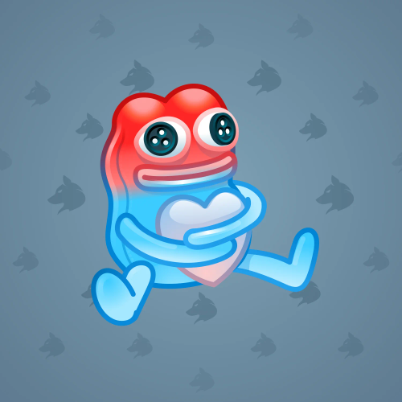

<html lang="en">
<head>
    <meta charset="UTF-8">
    <title>Mini App</title>

    
</head>
<body>
    

        <h1 align="center">PLUSH PEPE</h1>
        
150.000$

        
  

        
              

        
 <button id ="buy">купить</button> 

    

    
</body>
</html>
